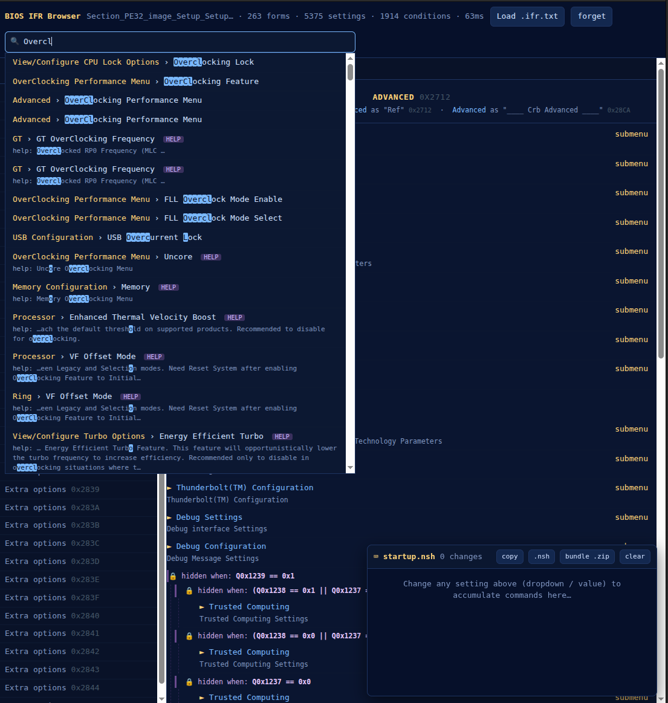
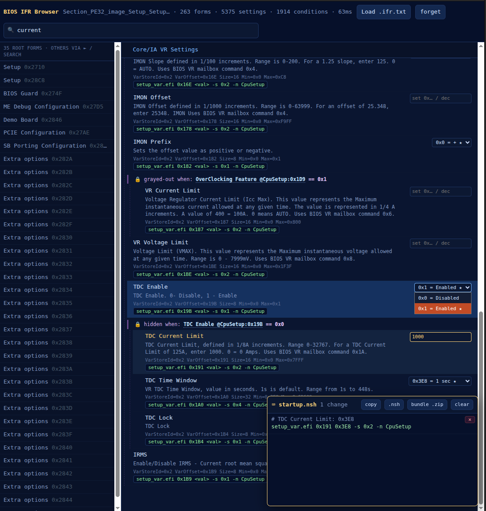

# BIOS Hidden Options Editor

**Unlock and edit the settings your laptop or mini-PC vendor hid in the BIOS — right in your browser.** Drop in a BIOS image, flip the options that are normally locked away (CFG Lock, overclocking, undervolting, power limits, VT-d, Above-4G…), and download a ready-to-boot **USB flash-drive bundle** that applies them. No other tools to install, nothing uploaded — it all runs locally on your machine.

**[▶ Open it](https://lolwheel.github.io/ifr-browser/)** · drag your **BIOS / SPI flash image** onto the page.

> **Want it fully offline?** Download **`ifr-browser-offline.html`** from the [latest release](https://github.com/lolwheel/ifr-browser/releases/latest) — a single self-contained file with everything inlined (the app, the firmware decoder, the UEFI shell, and the writer tool). Open it straight from disk; it never touches the network.

<table>
<tr>
<td width="50%" valign="top"><a href="docs/screenshot-browse.png"></a><br><sub><b>Browse &amp; search</b> — every option as a real BIOS-style screen, with the reason each one is hidden spelled out and searchable.</sub></td>
<td width="50%" valign="top"><a href="docs/screenshot-edit.png"></a><br><sub><b>Edit &amp; export</b> — change a value and the command to apply it is queued; download it all as a ready-to-boot USB bundle.</sub></td>
</tr>
</table>

## How it works — one stop, three steps

1. **Drop your BIOS image.** The tool finds the firmware's Setup menus, decompresses them, and shows every option — including the hidden ones — as real BIOS-style screens. Your image is parsed locally and never leaves your device.
2. **Flip what you want.** Change a dropdown or value and the exact command to apply it is queued automatically. Search by name (try *CFG Lock*, *overclock*, *undervolt*), see *why* an option is hidden, and — if you like — override that gate.
3. **Download the USB bundle** (`bundle .zip`), copy it to a FAT32 USB stick, and boot it. It auto-runs and applies your settings. The bundle already contains the UEFI shell and the writer tool — nothing else to download.

> ⚠️ **Changing BIOS settings can make a system unstable or unbootable.** Understand each change, keep a recovery path (CMOS clear / external SPI flasher), and proceed at your own risk. This tool only *generates* the commands — review them before you boot the stick.

**Already have an `.ifr.txt`?** Drop it on the app too — both a raw BIOS image and an extracted IFR dump are auto-detected.

**Hit a snag?** Click **log** in the header (or "View extraction log" after an error) and include that text when reporting an issue — it has enough detail to diagnose most problems.

---

## For power users

OEM laptops and mini-PCs (Minisforum, Beelink, etc.) ship AMI Aptio BIOSes with most of the useful CPU/power/VR menus **hidden** by `SuppressIf`/`GrayOutIf` gates. [`setup_var.efi`](https://github.com/datasone/setup_var.efi) can write those settings from the UEFI shell by raw VarStore **offset** — but finding the offset, value, and which lock gates what is painful. This app parses the BIOS's own **IFR** (Internal Forms Representation), renders it as the original Setup UI, and writes the exact commands for you.

### Features

- **Renders like real BIOS screens** — submenu navigation, breadcrumb, browser back/forward, deep-links (`#0x27F0`).
- **Resolved conditions** — `SuppressIf`/`GrayOutIf` expressions are decoded to readable, clickable references (e.g. *"grayed-out when `OverClocking Feature @CpuSetup:0x1D9 == 0x0`"*). References to **nameless control questions** show their `VarStore:offset` + type; with a raw BIOS loaded, an optional **infer names** toggle borrows a likely name from *another* firmware module that uses the same VarStore GUID + offset (heuristic — e.g. `!(MeSetup:0x1 u8 · FW Update == 0)`).
- **Override condition targets** — hover any condition reference and click ⊕ to set that VarStore byte's value. The override becomes a `setup_var.efi` line, and **every reference to that byte lights up** across the menus — handy for finding unlock gates (e.g. set `Setup:0xCC8 = 0x5A` to reveal hidden submenus).
- **Fuzzy search** across names, help, options, offsets and commands, ranked by relevance, with quick-search presets for the common tasks.
- **Live `startup.nsh`** — edits accumulate as exact `setup_var.efi <off> <hexval> -s 0x<bytes> -n <VarStore>` lines you can copy, save, or export as the bootable USB `.zip`. Persists across reloads.

### Getting the IFR yourself (optional)

The app does this for you from a raw BIOS image. To do it by hand: dump your BIOS region (vendor tool, [AFU](https://www.ami.com/), or a CH341A SPI programmer) → extract the `Setup` PE32 section with [UEFITool](https://github.com/LongSoft/UEFITool) → convert to text with [IFRExtractor-RS](https://github.com/LongSoft/IFRExtractor-RS) → drop the `.ifr.txt` on the app. A minimal standalone extractor (image → `.ifr.txt`, no editor) lives at [`bios2ifr.html`](https://lolwheel.github.io/ifr-browser/bios2ifr.html).

### Building

The in-browser firmware engine is compiled from [`tools/bios2ifr/`](tools/bios2ifr/) — UEFITool's LZMA/Tiano decompressors via Emscripten plus a forked IFRExtractor-RS via wasm-pack, inlined into the page ([how it works](tools/bios2ifr/README.md)). CI ([`.github/workflows/build-deploy.yml`](.github/workflows/build-deploy.yml)) builds it, deploys to GitHub Pages, and attaches the offline single-file + standalone extractor to tagged releases.

```sh
docker build -t ifr-wasm-dev tools/bios2ifr
docker run --rm -v "$PWD":/repo -w /repo ifr-wasm-dev bash tools/bios2ifr/build.sh /repo/dist
```

## License

MIT — see [LICENSE](LICENSE). Redistributed third-party components and their licenses are listed in [THIRD_PARTY.md](THIRD_PARTY.md).
